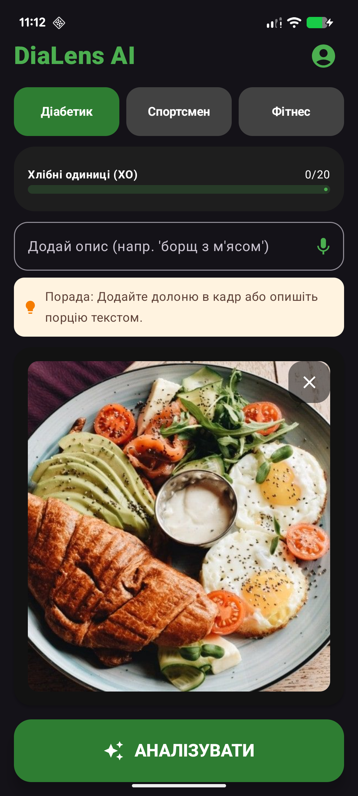
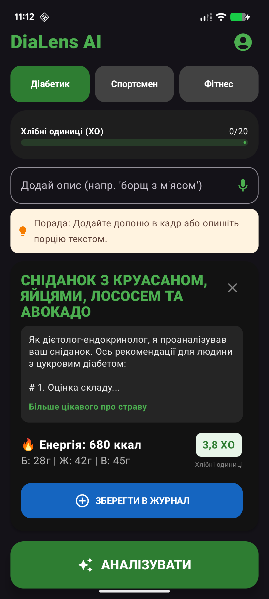

# DiaLens AI 🥗

**DiaLens** — це мобільний додаток на Android, який перетворює ваш смартфон на персонального дієтолога-ендокринолога. За допомогою штучного інтелекту **Google Gemini**, додаток миттєво аналізує їжу та надає персоналізовані поради.

## ✨ Основні можливості
* 📸 **Аналіз за фото**: Просто сфотографуйте страву, і AI розпізнає її склад.
* ✍️ **Текстовий ввід**: Опишіть страву голосом або текстом (наприклад, "Борщ зі сметаною").
* 🩺 **Персоналізація**: Поради адаптуються під ваш профіль (діабет, спорт, дієта).
* 📊 **Розрахунок нутрієнтів**: ККАЛ, Білки, Жири, Вуглеводи та Хлібні Одиниці (ХО).
* 📖 **Журнал харчування**: Зберігайте історію своїх обідів у локальну базу даних Room.

## 🛠 Технологічний стек
* **Мова**: Kotlin
* **UI**: Jetpack Compose
* **AI Core**: Google Gemini SDK (Flash 1.5 & Flash Lite)
* **Database**: Room Persistence Library
* **DI/Architecture**: MVVM, Coroutines, Flow

## 🔒 Безпека та конфіденційність
Проект реалізовано з дотриманням кращих практик безпеки:
- API-ключі **не зберігаються** в коді.
- Використовується файл `local.properties` та `BuildConfig` для захисту конфіденційних даних.
- Дані користувача зберігаються локально на пристрої.

---
*Розроблено як сучасне рішення для контролю харчування.*

## 📸 Скриншоти інтерфейсу

  
  

